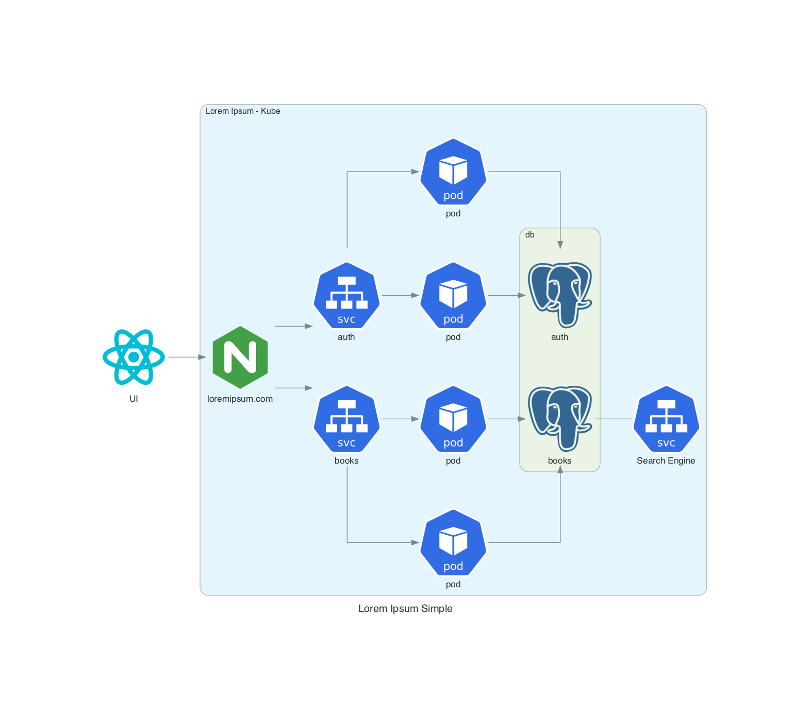
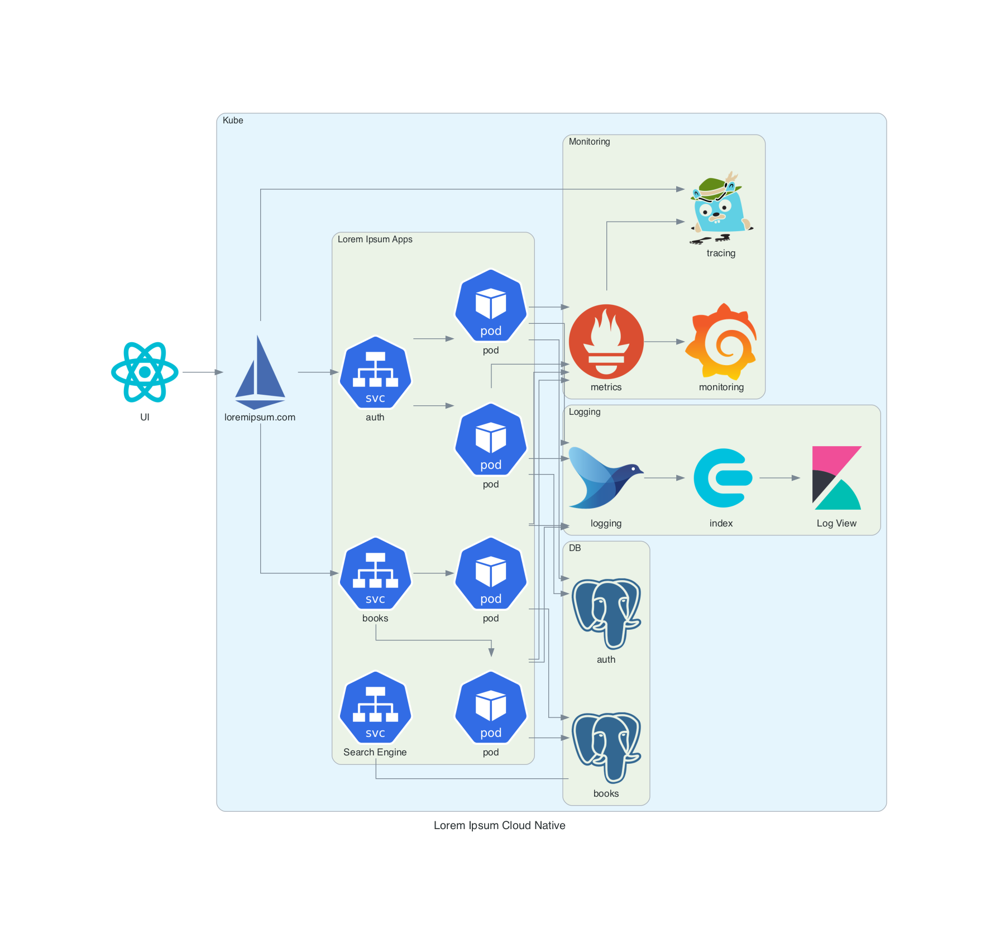
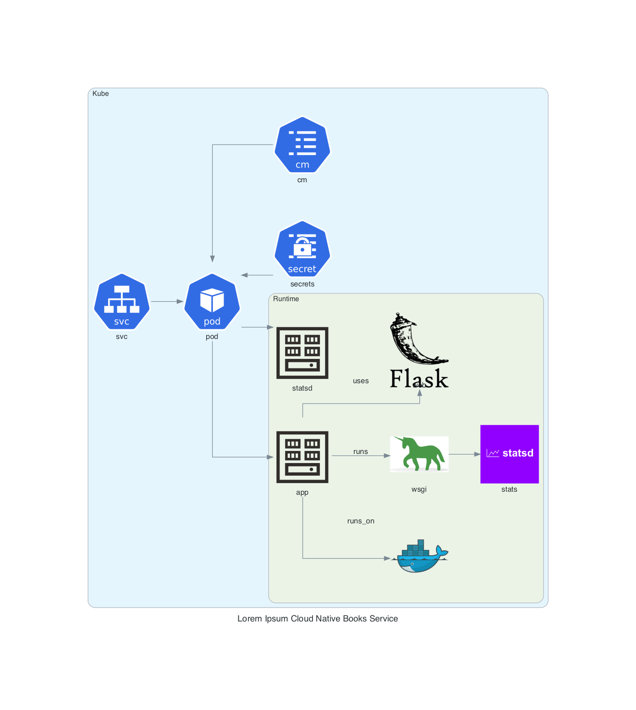
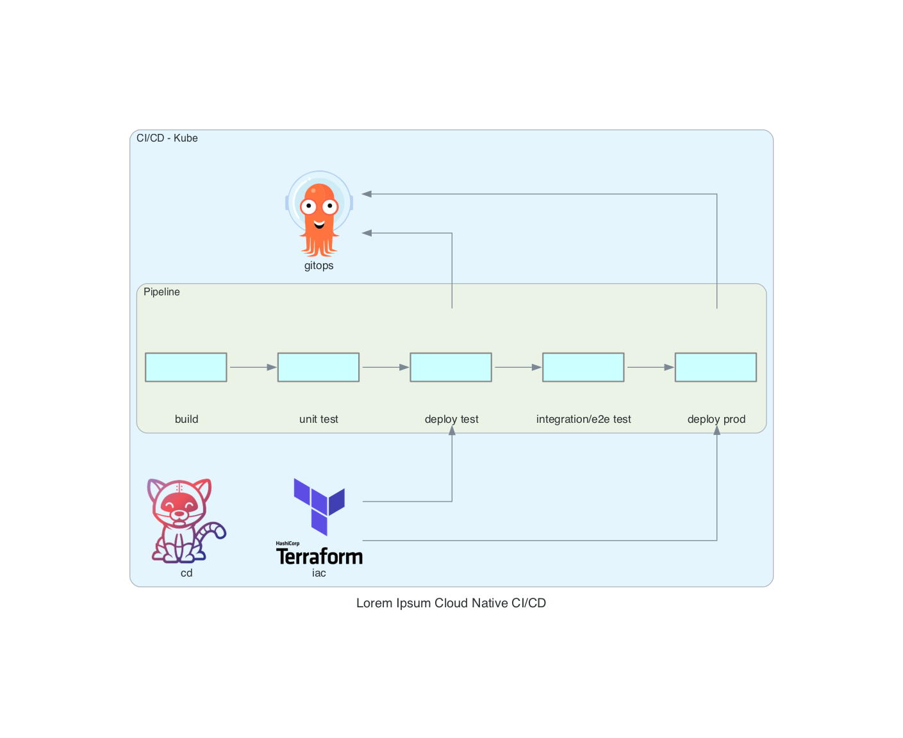
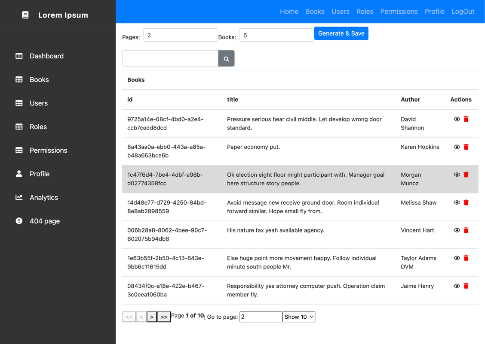
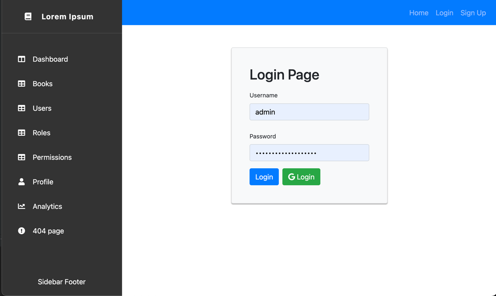
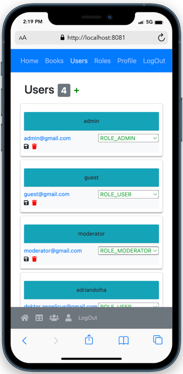

# Lorem Ipsum
This is a simple text generator, useful to generate books and get some random content to be used elsewhere.

It uses faker library in the backend to generate books with a given number of pages, a random title and random author.

The application is actually used as a technical playground to prove architectural concepts: 
* architecture styles: serverless, microservices
* cloud: aws, azure
* api gateway
* caching
* nosql
* monitoring: prometheus, grafana
* log aggregator: fluentd, elasticsearch, kibana
* frontend: React, Bootstrap
* etc.

Tech stack for the architecture described below:
- python
- terraform (s3 backup)
- tekton, argocd
- ambassador, aws api gw, istio
- eks, kuberneteds
- parameter store, kube secrets
- prometheus, grafana
- elasticsearch, fluentd, kibana
- flask, gunicorn, pytest, sqlalchemy, authlib, flask-swagger, pydantic
- faker
- docker
- react, bootstrap, cdbreact

## Achitecture diagrams
<details>
  <summary>Architecure diagrams for local and cloud native deployments </summary>
  
### Local

### Cloud Native

### Books service

### CI/CD

</details>
     

## Configuration and pre-requisites
Pre-requisites:
* docker
* kubernetes
* helm
* npm
* ~/.cloud-projects/oauth/public.key and ~/.cloud-projects/oauth/private.key (you can create these with openssl)
* ~/.cloud-projects/lorem-ipsum-secrets.yaml

### Lorem Ipsum secrets example
<details>
  <summary>Secrets example for lorem ipsum and authentication service </summary>

````
apiVersion: v1
kind: Secret
metadata:
  name: lorem-ipsum
  namespace: dev
type: Opaque
stringData:
  aurora-host: "postgres-postgresql.platform.svc.cluster.local"
  aurora-database: "lorem_ipsum_dev"
  root-url: "http://lorem-ipsum.dev.svc.cluster.local"
  aurora-user: "postgres"
  aurora-port: "5432"
  admin-user: admin
  admin-password: <admin_password>
  jwk-public-key-path: "/jwk/certs/public.key"
---
apiVersion: v1
kind: Secret
metadata:
  name: lorem-ipsum-auth
  namespace: dev
type: Opaque
stringData:
  aurora-host: "postgres-postgresql.platform.svc.cluster.local"
  aurora-database: "lorem_ipsum_dev"
  root-url: "http://lorem-ipsum.dev.svc.cluster.local"
  aurora-user: "postgres"
  aurora-port: "5432"
  admin-user: admin
  admin-password: <admin_password>
  guest-user: guest
  guest-password: <guest_password>
  jwk-public-key-path: "/jwk/certs/public.key"
  jwk_private_key_path: "/jwk/certs/private.key"
  google-client-id: "<google_client_id>"
  google-client-secret: "<google_client_secret>"

````
</details>

## Authentication and authorization
Authentication and authorization is done using OAuth and OIDC.

### Microservices

There are 2 main microservices with the React frontend. Currently, both lorem-ipsum and lorem-ipsum-authentication share
the same database, but this can be changed if need be.

#### Lorem Ipsum
This is a simple text generator, useful to generate books and get some random content to be used elsewhere.
It uses faker library in the backend to generate books with a given number of pages, a random title and random author.
Exposed APIs:
* create, read, update, delete individual books
* get all books with pagination and view (shared_books, my_books)
* generate random books with given no of pages and no of books
* search books
* get all words indexed by search engine (thread running in background)
* get stats: total no of books, words, pages and unique words
* health and metrics (prometheus)

#### Lorem Ipsum Authentication
This service is responsible for authentication and authorization and it's based on AuthLib to generate JWTs.
Exposed APIs:
* register & signin user
* social signin with google
* create, get, update, delete user
* get all users
* create, get, update, delete roles
* get all roles
* create, get, update, delete permissions
* get all permissions

#### Lorem Ipsum Web
React UI with Bootstrap. 

## Install
Run the following command from root folder:
````
./boostrap.sh apply
````
To cleanup resources, run the following command from root folder:
````
./destrpy.sh 
````
## Usage
 
Once deployed you can start using the app by accessing local url http://localhost:8081/home.
<details>
  <summary>UI screenshots </summary>







</details>

 